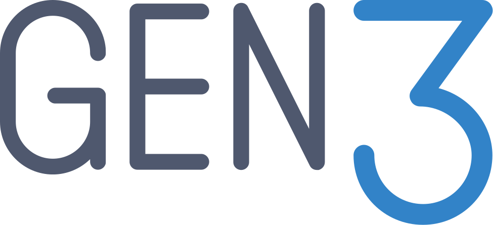

# docs-gen3
This is the primary repository for public Gen3 technical documentation.  It is designed to be easy for the Gen3 community to participate in the update of this content.  

## How to request updates
Create an issue within this repo to report on issues or gaps in the documentation.  If it is a large change you would like to see, it is better to start with an issue.  If it is something small please just create a PR and we can review that.

## Step to submit a PR.

If you know what changes are needed we encourage you to create a PR.  Follow these steps to make changes and verify them.

### Install MkDocs

Please follow instructions found [here](https://www.mkdocs.org/user-guide/installation/) to install MkDocs on your local machine.

### Clone docs-gen3 repo locally

Clone the current `main` branch of the docs-gen3 repo. Create a new branch.  Make your changes and commit to your branch.  Follow naming conventions for branches and commits described in the [code contribution section of the docs](https://github.com/uc-cdis/docs-gen3/blob/Update-to-readme/docs/gen3-resources/developer-guide/contribute.md#naming-conventions).

### Serve docs repo locally to verify changes

Display your changes locally by serving the site using the command `mkdocs serve`.  Make any changes necessary so your new documentation renders correctly and no errors or warning are generated in the terminal.

Note, you should not need to build the site using `mkdocs build`.

### Submit your PR

Once you submit your PR, a member of the CTDS staff may request changes or ask you questions regarding your update.
