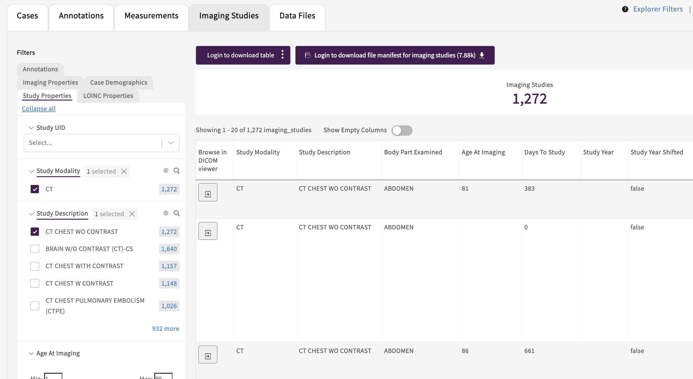

# Customize appearance of the front end

Below we show a few examples of how to customize the Gen3 Data Portal.

For a more technical and complete background, see [portal configurations on GitHub][portal config].

## Login Page


### Login Image

Customize the image that appears on the [Login Page][data hub login] with a vector graphic (eg. *.svg) of your choice.

![Login Page][login page image]

* [Review code to include the path-to-image in gitops.json][gitops.json login page image].


### Information on Login and Commons

Customize the text that appears on the [Login Page][data hub login] by specifying title, description, subtitle, contact, or email.

* [Review the code to edit title, subtitle, text, contact, and email][gitops.json login page text].


## Landing Page

### Information on Commons

Customize the name of the Data Commons, the info text, and the button below that  appear on the top left side of the Landing Page after logging in.

![landingpage_info][landing page text]

* [Review the code to edit heading, text, and link][gitops.json landing page text].


### Summary Statistics

Customize the summary statistics that appear on the top right side of the Landing Page after logging in. The attributes are graphQL fields, which must be in the dictionary, configured in the etlMapping.yaml, and populated with data on the backend.

![landingpage_counts][landing page stats]

* [Review the code to edit graphQL queries][gitops.json graphql].
* [Review the code to edit the graphQl queries after being logged in][gitops.json graphql logged in].


### Cards

Customize the cards that appear on the bottom of the Landing Page after logging in.

![landingpage_cards][landingpage cards]

* [Review the code to edit name, icons, body, link, and label of the cards][gitops.json cards].
* Adding a new icon requires saving the icon in [this repository][icons] and [in this file][icons index].


## Navigation Items

Customize the icons, link, and names that appear on the Data Commons navigation bar.
The "tooltip" shows text upon hovering over the icon.

![navigationbar][navigationbar image]

* [Review the code to edit icon, link, color, tooltip, and name of the navigation items][gitops.json navbar].
* Adding a new icon requires saving the icon in [this repository][icons] and [in this file][icons inex].

## Data Commons or Mesh Title

Customize the title that appears in the top left corner such as for the [Biomedical Research Hub][brh].

![name-commons][commons name image]

* [Review the code to edit the title of the Data Commons][edit title].


## Top Bar

Customize the top bar that appears in the top right corner.

![topbar][topbar image]

* [Review the code to edit the top bar (link, name, icon, dropdown) of the Data Commons][gitops.json topbar].


## Color Theme

Customize the color theme for buttons, top navigation bar, and any types of charts on the Exploration and Landing Page.

* [Review the code to edit the 9 colors of a Data Commons][gitops.json color updates].


## Footer Logo

Customize the logos in the Footer.

![footer][footer image]

* [Review the code to edit the source, link, and name of logos in the footer of a Data Commons][gitops.json footer].


## Notebook Browser

Customize the [Notebook Browser][brh notebooks] page to preview Jupyter Notebooks by adding images, titles, descriptions, and links to the Jupyter Notebook.

![notebookbrowser][notebook image]

* [Review the code to edit the title, description, link, and imageURL][gitops.json notebooks].


## DICOM Viewer integration

In the [Medical Imaging Data Resource Commons (MIDRC)][MIDRC] we have integrated a DICOM Viewer into the Data Commons.  We have included some details below on the integration.

### Overview

We use the [Ohif viewer][OHIF site] for the frontend and the [Orthanc server][Orthanc site] for the backend.

* [Ohif viewer fork][ohif fork](https://github.com/uc-cdis/viewers)
    * The viewer is accessible in Gen3 at `<Gen3 portal hostname>/ohif-viewer`, so the `PUBLIC_URL` environment variable must be set to `/ohif-viewer` ([a3f7848][ohif viewer commit]). It can only be set at build time, so the only option was to fork the repository and build the image ourselves ([5c5c48a][ohif viewer commit 2]).
    * We use Ohif viewer v3.
* [Orthanc server fork][orthanc fork]
    * The Orthanc server supports custom authorization filters. We forked the repository so we could add a [filter][filter fork] that communicates with the [Gen3 policy engine][arborist] to check user authorization.
    * Orthanc supports various storage options. We are currently using PostgreSQL and investigating using AWS S3. Note that one of the two will likely not be maintained anymore in the future.

### Deployment

#### Services

Add the DICOM viewer and **one** of the two DICOM server services to your deployment manifest:
```
"ohif-viewer": "707767160287.dkr.ecr.us-east-1.amazonaws.com/gen3/ohif-viewer:gen3-v3.8.0",
"dicom-server": "707767160287.dkr.ecr.us-east-1.amazonaws.com/gen3/gen3-orthanc:gen3-0.1.2",
"orthanc": "docker.io/osimis/orthanc:master",
```

* `ohif-viewer` is the frontend
* `dicom-server` is the backend set up to use PostgreSQL
* `orthanc` is the backend set up to use AWS S3

If your Gen3 deployment uses [cloud-automation][cloud automation], you can then set up the services by running:

* `gen3 kube-setup-dicom` to set up and deploy `ohif-viewer` and/or `orthanc` (if you have chosen this server).
* `gen3 kube-setup-dicom-server` to set up and deploy `dicom-server` (do not run this if you have not chosen this server).

The Ohif viewer configuration may need to be updated as follows:

* Edit `~/Gen3Secrets/g3auto/orthanc-s3/app-config.js`
* Make sure `wadoUriRoot` is set to "/dicom-server/wado" if using `dicom-server`, or "/orthanc/wado" if using `orthanc`.
* Similarly, set both `qidoRoot` and `wadoRoot` to "/dicom-server/dicom-web" if using `dicom-server`, or "/orthanc/dicom-web" if using `orthanc`.
* After making updates, run `kubectl delete secret orthanc-s3-g3auto && gen3 kube-setup-dicom`

Once the services are deployed and the [access configured](#authorization), after logging in as an authorized user, you should be able to access the services at:

* `ohif viewer`: `<Gen3 portal hostname>/ohif-viewer/viewer?StudyInstanceUIDs=<DICOM study ID>`
* `dicom-server`: `<Gen3 portal hostname>/dicom-server/app/explorer.html`
* `orthanc`: `<Gen3 portal hostname>/orthanc/app/explorer.html`

#### Authorization

See [this doc][user yaml] for details on setting up authorization through a `user.yaml` file.

* For `ohif-viewer` and `dicom-server`:
  * End users need the following access to view files in the DICOM viewer:
    * service: "dicom-viewer"
    * method: "read"
    * resource: "/services/dicom-viewer/studies/\<DICOM study ID\>"
    * The recommended setup is to create a policy with access to all DICOM studies (resource "/services/dicom-viewer/studies") and grant it to all users, or to all logged in users.
  * Administrators need the following access to interact with the server API (such as to submit files):
    * service: "dicom-viewer"
    * method: "create"
    * resource: "/services/dicom-viewer"
* For `orthanc`: **in addition to** the above, add the following:
  * End users:
    * service: "orthanc"
    * method: "read"
    * resource: "/services/orthanc/studies" (note that per-study access is not supported at the moment)
  * Administrators:
    * service: "orthanc"
    * method: "create"
    * resource: "/services/orthanc"
  * This may change in the future.

#### Portal explorer integration

The explorer page of the portal can be configured to link to the DICOM viewer. The elastic search documents must have a field corresponding to the DICOM study ID.



Configure your explorer page tab as follows:
```
"explorerConfig": [
    {
      "tabTitle": "Imaging Studies",
      "table": {
        "enabled": true,
        "fields": [...],
        "dicomViewerId": "dicom_study_id",
        "dicomViewerUrl": "ohif-viewer",
        "dicomServerURL": "dicom-server",
        "linkFields": [
          "dicom_study_id"
        ]
      }
    }
]
```

* `dicomViewerId`: (optional) name of the field that corresponds to the DICOM study ID.
* `dicomViewerUrl`: (optional; default: "dicom-viewer") to override the path to the DICOM viewer.
    * Set to "ohif-viewer" if you're using the `ohif-viewer` service.
* `dicomServerURL`: (optional; default: "dicom-server") to override the path to the DICOM server.
    * Set to "dicom-server" if you're using the `dicom-server` service.
    * Set to "orthanc" if you're using the `orthanc` service.
* Use `linkFields` to display a button in the explorer table instead of the study ID as text.

See the [portal configuration docs][portal config] for the latest details.

### Submission

```python
# depending on whether you use `dicom-server` or `orthanc`:
endpoint = "<Gen3 portal hostname>/dicom-server/instances"
endpoint = "<Gen3 portal hostname>/orthanc/instances"

gen3_access_token = ""
file_path = ""
if not file_path.lower().endswith(".dcm"):
  raise Exception(f"'{file_path}' is not a DICOM file")

with open(file_path, "r") as f:
  file_contents = f.read()

headers = {
  "Content-Type": "Application/DICOM"
  "Authorization" = f"Bearer {gen3_access_token}"
}
resp = requests.post(endpoint, data=file_contents, headers=headers)
if resp.status_code != 200:
  raise Exception(f"Unable to upload '{file_path}': {resp.status_code} - {resp.text}")
```

### Developer notes

1. Orthanc: We used the `jodogne/orthanc` image when using PostgreSQL for storage, but when switching to AWS S3 storage, we were not able to get it working with this image, so we switched to the `osimis/osiris` image. This is why the deployment is different for `dicom-server` (PostgreSQL) and `orthanc` (S3).
2. For `dicom-server`, the authorization checks are in our [custom authorization filter][filter fork].
3. For `orthanc`, right now the authorization checks are [in revproxy][orthanc config]. It should still be possible (and is preferable) to add the custom authorization filter above to this server: docs [here][orthanc auth doc].
4. About authorization granularity
    * The authorization is currently at the DICOM study ID level, because that's what the DICOM server receives when a user tries to open a file in the DICOM viewer. This means administrators can grant access at the study level (`resource: "/services/dicom-viewer/studies/<DICOM study ID>"`) or grant blanket access (either you have access to see all DICOM files in the DICOM viewer, or you don't have access to see any files) (`resource: "/services/dicom-viewer/studies"`).
    * Some use cases may require the ability to grant access at a different granularity, such as at the program/project level to match other Gen3 services. Some options to enable this:
      * List all the DICOM study IDs in the user.yaml in order to give individual users access to specific studies.
      * Update the DICOM server [authorization filter][filter fork] to somehow know the mapping of DICOM study ID to Gen3 program and project. The mapping could be hardcoded, queried from the database through Peregrine or Guppy (preferred option), or directly queried from the database by accessing the Sheepdog database.
        * Caveat: `dicom-server` uses this filter, but `orthanc` doesn't. Maybe it could be updated to use the filter (see #3 above).


<!-- Links -->
[portal config]: https://github.com/uc-cdis/data-portal/blob/master/docs/portal_config.md
[data hub login]: https://gen3.datacommons.io/login
[login page image]: img/login_page.png
[gitops.json login page image]: https://github.com/uc-cdis/cdis-manifest/blob/456e1a3b5b3cc5dc23b83e1f96c0770a2007162a/gen3.datacommons.io/portal/gitops.json#L130
[gitops.json login page text]: https://github.com/uc-cdis/cdis-manifest/blob/456e1a3b5b3cc5dc23b83e1f96c0770a2007162a/gen3.datacommons.io/portal/gitops.json#L124-L129
[landing page text]: img/landingpage_info.png
[gitops.json landing page text]: https://github.com/uc-cdis/cdis-manifest/blob/456e1a3b5b3cc5dc23b83e1f96c0770a2007162a/gen3.datacommons.io/portal/gitops.json#L39-L44
[landing page stats]: img/landingpage_counts.png
[gitops.json graphql]: https://github.com/uc-cdis/cdis-manifest/blob/456e1a3b5b3cc5dc23b83e1f96c0770a2007162a/gen3.datacommons.io/portal/gitops.json#L3-L36
[gitops.json graphql logged in]: https://github.com/uc-cdis/cdis-manifest/blob/4a922a04456423fea5d1e59c5431cedb460280d0/data.midrc.org/portal/gitops.json#L98-L113
[landingpage cards]: img/landingpage_cards.png
[gitops.json cards]: https://github.com/uc-cdis/cdis-manifest/blob/456e1a3b5b3cc5dc23b83e1f96c0770a2007162a/gen3.datacommons.io/portal/gitops.json#L46-L75
[icons]: https://github.com/uc-cdis/data-portal/tree/master/src/img/icons
[icons index]: https://github.com/uc-cdis/data-portal/blob/67f2b83227b9c3b48143bd2938cad160fc225394/src/img/icons/index.jsx
[navigationbar image]: img/navigationbar.png
[brh]: https://brh.data-commons.org/
[commons name image]: img/name-commons-or-mesh.png
[edit title]: https://github.com/uc-cdis/cdis-manifest/blob/a68f8df12173e4b9d06dcdf3fad2cc1643a73f89/gen3.theanvil.io/portal/gitops.json#L71-L72
[topbar image]: img/topbar.png
[gitops.json topbar]: https://github.com/uc-cdis/cdis-manifest/blob/4a922a04456423fea5d1e59c5431cedb460280d0/data.midrc.org/portal/gitops.json#L146-L171
[gitops.json color updates]: https://github.com/uc-cdis/cdis-manifest/blob/4a922a04456423fea5d1e59c5431cedb460280d0/data.midrc.org/portal/gitops.json#L146-L171
[footer image]: img/footer.png
[gitops.json footer]: https://github.com/uc-cdis/cdis-manifest/blob/551f0963e60f6000ae8b9987592495406a031c81/gen3.datacommons.io/portal/gitops.json#L156-L168
[brh notebooks]: https://brh.data-commons.org/resource-browser
[notebook image]: img/notebookbrowser.png
[gitops.json notebooks]: https://github.com/uc-cdis/cdis-manifest/blob/0e5a08eed8b417a721a6324f820abe8ea4ef4e17/chicagoland.pandemicresponsecommons.org/portal/gitops.json#L1097-L1175


<!-- DICOM Viewer -->
[MIDRC]: https://data.midrc.org/
[OHIF site]: https://ohif.org
[Orthanc site]: https://www.orthanc-server.com
[ohif fork]: https://github.com/uc-cdis/viewers
[ohif viewer commit]: https://github.com/OHIF/Viewers/commit/a3f7848b2f00721a5f4ab994754d828fd00cdfb2
[ohif viewer commit 2]: https://github.com/OHIF/Viewers/commit/5c5c48ac19e4294c38b8bb03691e1b4250c432ba
[orthanc fork]: https://github.com/uc-cdis/OrthancDocker/tree/master-rebase
[filter fork]: https://github.com/uc-cdis/OrthancDocker/blob/gen3-0.1.2/orthanc-gen3/authz_filter.py
[arborist]: https://github.com/uc-cdis/arborist
[cloud automation]: https://github.com/uc-cdis/cloud-automation
[user yaml]: https://github.com/uc-cdis/fence/blob/f102fab/docs/additional_documentation/user.yaml_guide.md
[orthanc config]: https://github.com/uc-cdis/cloud-automation/blob/f197889/kube/services/revproxy/gen3.nginx.conf/orthanc-service.conf
[orthanc auth doc]: https://book.orthanc-server.com/plugins/authorization.html
